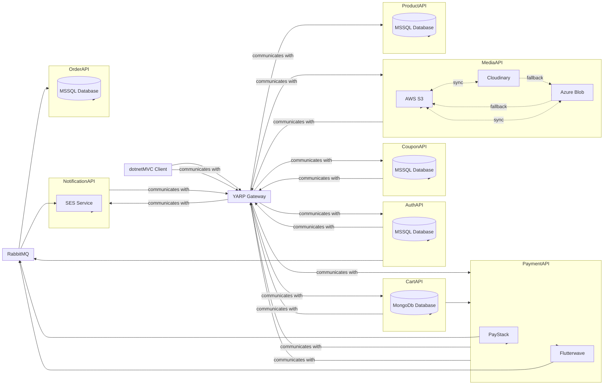

# MainMarke# Microservices-based E-commerce Platform Architecture

Welcome to the Microservices-based MainMarket E-commerce Platform Architecture README. This document provides a comprehensive overview of the architecture, components, and communication flow of our cutting-edge e-commerce platform. Designed with modern technologies and principles, our platform offers scalability, resilience, and flexibility to meet the demands of today's online businesses.

## Table of Contents
- [MainMarke# Microservices-based E-commerce Platform Architecture](#mainmarke-microservices-based-e-commerce-platform-architecture)
  - [Table of Contents](#table-of-contents)
  - [Overview](#overview)
  - [Installation](#installation)
    - [Prerequisites](#prerequisites)
    - [Installation Instructions](#installation-instructions)
  - [Usage](#usage)
  - [Features](#features)
  - [Examples](#examples)
  - [Contributing](#contributing)
  - [License](#license)
  - [Contact Information](#contact-information)

## Overview

MainMarket e-commerce platform is built on a microservices architecture, allowing us to break down complex functionalities into smaller, independent services. Each service is responsible for a specific aspect of the e-commerce workflow, enabling rapid development, deployment, and scalability. Leveraging cloud-native technologies and best practices, our platform ensures high availability, fault tolerance, and efficient resource utilization.

## Installation

### Prerequisites

- Docker
- .NET SDK
- Node.js
- MongoDB
- MSSQL Server
- RabbitMQ

### Installation Instructions

1. Clone the repository.
2. Navigate to the project directory.
3. Run `docker-compose up` to start the containers.
4. Visit `http://localhost:3000` to access the application.

## Usage

To use the e-commerce platform:

1. Sign up for an account.
2. Browse products, add them to your cart, and proceed to checkout.
3. Apply any available coupons during checkout.
4. Complete the payment process.
5. Receive order confirmation via email.

## Features

- User authentication and authorization
- Shopping cart management
- Coupon management
- Media storage and management
- Order processing
- Payment processing
- Product catalog management
- Asynchronous communication via RabbitMQ

## Examples

For real-world examples and use cases, refer to the [examples](examples/) directory in the repository.

## Contributing

We welcome contributions from the community. Please read our [contributing guidelines](CONTRIBUTING.md) before submitting pull requests or reporting issues.

## License

This project is licensed under the [MIT License](LICENSE).

## Contact Information

For questions, feedback, or support, please contact us at [contact@example.com](mailto:contact@example.com).
